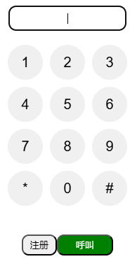

# vue3-webphone-component

This project is not finished yet.

The effect is as follows:



You can use the component to make call to a freeswitch server.


1. Add nginx server to solve CORS issues(my OS is Windows. If you are using linux or other systems, you should modify the volume in command)

```
docker run --name ng -d -p 8888:80 -v .\nginx\nginx.conf:/etc/nginx/nginx.conf:ro nginx
```

 The IP configuration for the freeswitch service is at ./nginx/nginx.con.

